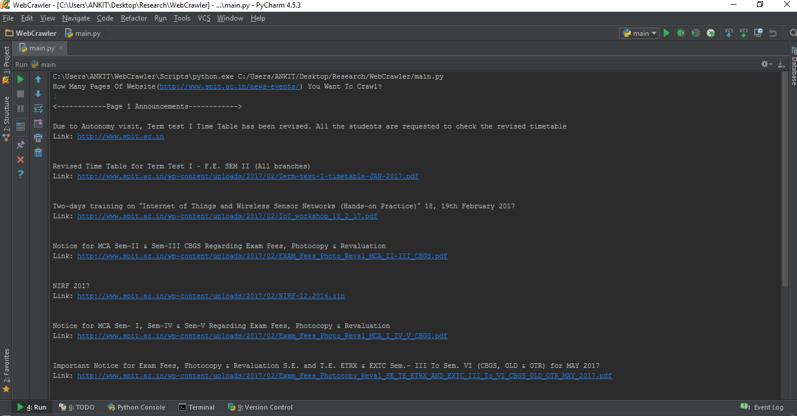

# Python Web Crawler
### Introduction
A simple web crawler that crawls and prints the announcement title and link of [Website](http://www.spit.ac.in/news-events/)

Basic useful feature list:

 * Takes number of pages to crawl as an input
 * crawls and prints the announcement title and link of this [Website](http://www.spit.ac.in/news-events/)

## Steps To Run:

 * Download Project
 * Install modules requests,beautifulsoup4 using pip installer(eg: pip install requests)
 * Run main.py file
 
## Output Screenshot:

